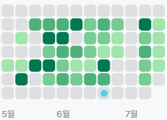
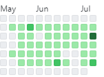
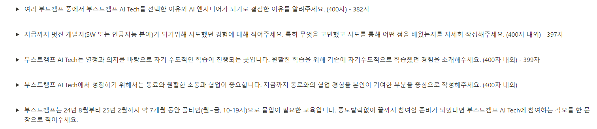
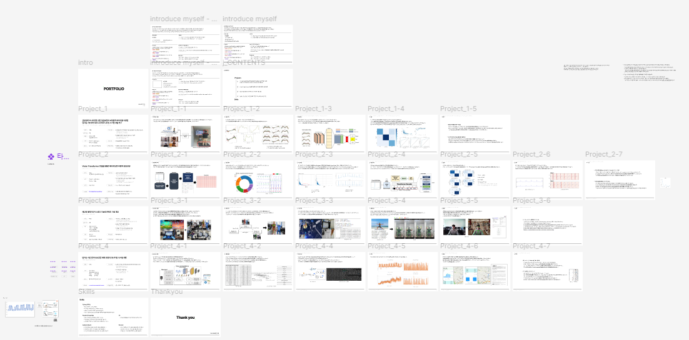
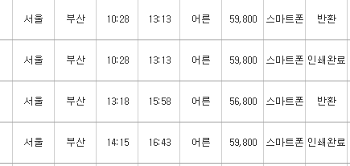
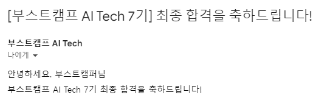

# 네이버 부스트캠프 AI Tech 7기 지원 후기 & 합격

## 지원 동기

나는 석사 졸업 후에, 마땅히 갈 곳이 없어서 취직을 못하던 와중에 지도 교수님께서 행정조교로 추천해주셨고.. 학교에서 취업 전까지 행정조교로 일하고 있었다.

직원 선생님들께서 상황도 다 아시고.. 이전에 이 사업단에서 행사같은 것들을 많이 도와드려서 선생님들께서 나의 편의를 정말 많이 봐주셨다. (감사합니다!!!)

그래서 맘 편히 준비할 수 있었고.. 목표를 세웠다.

행정조교로 일하면서 다짐했던 목표!

- **1일 N 알고리즘 문제 풀기**
- github 잔디 심기

새로 시작하는 마음으로 알고리즘을 위한 Github Repo이랑 백준 아이디도 새로 만들었다!

5월 초부터 현재 글 작성일 기준 7월 19일까지 주말빼고는 거의 무조건 한 문제 이상은 풀었고 알고리즘 이외에도 다른 공부도 했었다.. 추가로 포트폴리오랑 이력서도.. 얼추 완성.. (이력서는 나중에 다시 써야한다..)

찬찬히.. 취업 준비를 하던 와중에 정말. 우연히. 게시판에 붙어있는 네이버 부스트캠프 AI Tech 모집 포스터가 있었다..

옛날부터 멋쟁이사자처럼, SK Rookies, SAFFY.. 이런 것들을 못해봤고 하다못해 해커톤 하나도 나가지 못했었고 그런거에 대한 동경이 되게 컸다. 워낙 대학원을 빨리 시작했고.. 대학원에서는 오로지 공부만 신경쓸 수 없는 상황이었기에 이렇게 공부만!! 하는 것을 해보고 싶었다.

그 중에 네이버 부캠이 프로젝트를 많이할 수 있다는 소문을 들었고, 기수가 지나면 지날수록 체계화 되는 커리큘럼과 수준 높은 강의들이 있어서.. 정말로 하고 싶었다.

그래서 마음먹고 준비하기로했다!

## 준비 과정

우선.. 여타 부트캠프와 달리 네이버 부스트캠프(줄여서 붓캠)는 코딩테스트 + 이론문제가 있다.

특히 AI Tech의 경우 Vector, Matrix, Gradient, CNN, Linear Algebra..등 생각보다 까다로운 이론 문제들을 출제한다. (6기 사전 진단 참고)

이번 7기에는 코딩테스트와 이론문제를 포함한 역량테스트를 **1회**만 실시하기에, 문제들이 꽤 어려울 것이라고 생각했다.

### 자소서

어디를 지원하던간에, 자소서는 빠질 수 없었다.

총 4개 문항이었고 400자 이내 였다. 근데 알다시피 자소서는 짧게 쓰는게 더 어렵다..

초안을 작성하고 ChatGPT가 조금.. 다듬어주고.. 다시 내가 다듬고.. 반복

대부분 연구실에 있으면서 수행했던 프로젝트에 관한 내용이 많았고, 대학교를 들어갈 때부터 생각했던 내용들로 채워나갔다.

특히 1번 문항에서 AI 엔지니어가 되기로 결심한 이유를 작성하면서, 다시 한번 나를 되돌아볼 수 있었고 거기서 느꼈던 점들로 작성했다. “자소설”보단 정말로 내가 겪었던 것과 실패했던 것 그리고 내가 무엇을 배웠고 어떻게 고쳐나갔는지에 대해 작성했다.

2번 문항에서는 여태 내가 개발을 해왔던 것을 떠올리며 가장 지키지 못했던 것과 모든 프로젝트에서 아쉬워했던 부분에 대해 회고를 하며 작성했다. 

3번의 경우 석사 과정을 거치면서 혼자 묵묵히 연구하고 공부했던 경험이 있었기에 자기주도적으로 공부하는 것에 대해 문제 없다라는 것을 어필할 수 있었다. 특히나 나는.. 석사 과정을 시작하면서 연구 주제를 바꾸는 바람에 혼자 공부해야 했었던 것이 컸다.

4번의 경우.. 솔직히 나에겐 이 문항이 가장 어려웠는데, 네이버 부스트캠프에서 프로젝트를 했던 후기들을 찾아보고 가장 유사했었던 경험에 대해 작성했다. 학사 졸업 프로젝트를 2021년에 했었는데, 그때 당시 아직 COVID-19가 유행했을 시기였고 학교에서도 비대면 프로젝트를 권고했었기에.. (실제로 팀원 중에 얼굴 한번도 못 본 팀원도 존재했다) 그때 당시 어떻게 프로젝트를 수행했었는지를 떠올리며 작성했다.

그리고….. 생각보다 400자는 너무 빡빡했다. (나는 할 얘기가 이렇게나 많은데!!)

### 코딩테스트

나는 아무래도 이 공고를 보기 전부터 코딩테스트를 준비해왔기에 걱정이 없었다. 라고 하면 정말 말도 안되는 이야기고.. 사실상 코딩테스트를 인생 처음으로 보는거여서 어떻게 문제가 나오는지, 어떻게 진행되는지 하나도 몰랐다.

특히나 이번은 테스트가 **1번**밖에 없기에 이 하나에 내 역량을 쏟아야 했었다.

다른 후기들 보면 문제 난이도 자체는 그리 어렵지 않고 빡구현 문제들이 많다고 했다. 그래서 마침 [Solved.ac](http://Solved.ac) 의 CLASS 3 문제들도 다 풀어가는 와중이었기에 6월 중후반부터는 Programmers 1~2단계 구현 문제 위주로 풀었다. 그리고 나는 내가 멍청했다는 것을 깨달았다.

6기 역량테스트에서는 Programmers에서 테스트를 했었고 6기 사전 진단 문제들도 Programmers여서 “음~ 이번에도 여기구나” 하고 준비를 했었는데, 후에 말할 7기 Pre-Course에서의 사전진단은.. 구름 IDE에서 테스트를 본다는 것이었다.. 어찌보면 정말 다행이었다.

구름 IDE 환경에 익숙해진 상태에서 시험을 보아야하기에 진짜 지원서 내고 4일 동안은…. 미친듯이 구름에 있는 문제만 쭉 풀었다. (+ 7기 사전 진단 문제)

사전 진단 문제를 보았을 때에도 이제는 빡구현 문제보단 자료구조(Queue, Stack, Hash map 등..)를 사용한 문제들도 있다는 것을 알 수 있었다.. 그래서 자료구조 관련한 문제들도 백준 포함해서 싹.. 훑어보고 다시 공부하고 했다.

여담으로, 준비할 때 풀어보면 좋을 문제들과 아닌 문제들을 구별해야하는데, 나는 정답률과 시도한 인원을 기준으로 정렬해서 문제를 풀었다.

구름에 있는 Level 체계가 생각보다 뒤죽박죽이어서 잘 골라내야했다.
(예를 들어, 구름 Level-2 문제가 백준에선 [플래3](https://www.acmicpc.net/problem/13303)(!) 문제였다.. / 참고 : 13303-장애물경기)

### AI 기초 공부

부스트캠프를 준비하면서도 어려우면서도 좋았던 것 중에 하나가 난 Pre-Course라고 생각한다.

정말 유명하고 뛰어난 교수님들과, 연구진분들께서 강의해주시는 것이어서 내가 여태 석사 과정을 하면서 배우지 못했던 것들, 혹은 얕게 알고 있었던 부분에 대해 명확히 알게될 수 있었다.

난 20살 때부터 지금까지 8년 동안 거의 Python만 해왔기에 Python 기초 강의는 스킵했지만, 객체지향 관련된 내용 하나만 들었을 때에도 너무 좋았던 강의였기에, 아마 Python을 모르는 사람들이라면 너무 좋았을 강의라고 생각한다.

아무튼! 사전 진단에서든 공식 홈페이지에서든 Pre-Course 강의가 필수는 아니지만? 여기 내용으로 문제를 출제한다고 해서 수강을 안 할 수가 없었다..ㅋㅋ 거기다가 한 Section마다 Quiz도 나오는데 여기서 비슷한 유형을 출제할 것이라고 이미 사전 진단 페이지에 못 박아놔서 무조건!!! 해야했다
(물론 AI 기초에 대해 빠삭하신 분들이라면 패스하셔도 되지만… 하는게 좋다고 생각)

시험 공부는 6기 사전 진단(네이버 블로그), 7기 사전 진단 (Pre-Course), Quiz (Pre-course)를 통해 강의에서 배웠던 내용들을 테스트해가며 오답노트 마냥 정리하고, 공부했다. 거진 답을 외웠다.

솔직히 이 역량테스트 준비하는 방법으로는… 걍 Pre-Course 열심히 들으세요 밖에 없는 것 같다.
여기서 다 나온다..

(실질적으로 못 풀어서 찍은 문제도 있다..)

### 포트폴리오

사실 포트폴리오는 취업을 위해서 예전부터 계속 준비해두었다.

Figma로 했었는데.. 그냥 파워포인트로 할걸 후회 좀 했다ㅎ.. 그래도 디자인하는 지인분에게 도움도 받아서 포트폴리오 윤곽잡고 프로젝트 4개정도 해서 써내려 갔다.

피그마로.. 열심히 만들어봤다..

대학원 다니면서 했던 프로젝트랑 졸업논문을 썼고 글보다는 그림위주의 포트폴리오를 작성했다.

근데, 특정 회사 양식에 맞추었던 포폴이긴한데, 시간상 어쩔 수 없이 그대로 제출했다.

## 역량 테스트

역량 테스트 보는 날에 사실 부산 여행이 계획된 상태라서.. 조금 어수선하게 했다.

일단 기차표만 3번인가 수정…….

최대한 역량 테스트 시간에… 맞추었다…

테스트 마치는 시간에 맞춰서 1시간 텀두고 기차표를 예약했고.. 마음은 조급해져갔다.

나는 내일배움카드를 미리 발급 받은 상태라 신분증과 함께 실물로 준비해둔 상태로 바로 보여드렸고, 시험이 시작됐다.

코테를 준비만 해봤지, 한번도 본 적이 없어서 조금 떨리긴 했으나… 나름 꽤 열심히 준비했다고 생각해서 자신있게 해보자는 마인드를 장착했다.

규정상 문제들을 말할 순 없지만 코테 난이도는 Programmers Lv2 중, Baekjoon 실버3~실버1 문제 정도? 한 문제는.. 골드 5정도…? 되는데, 즉각적으로 바로 코딩이 되는 문제들은 아니었다.

근데 사실 코테보다는 AI 기초 지식문제가 좀 빡셌다. 아무래도 테스트를 1번만 보다보니, 코테 문제도 많은데, AI 기초 지식 문제는 더 많았다.

그래서 3시간 중 2시간 55분을 쓰고 시험을 마무리했따.. 그리고 바로 서울역으로 ㅌㅌㅌㅌ

## 합격이래!

합격 메일이다…!

역량 테스트 이후 9일? 정도 시간이 흐른 뒤 합격 메일을 받았다!

내 예상 코테는 90%를 푼 것 같았는데… 진짜였나보다ㅎㅎ

합격 당시에 행정조교로 일하고 있었는데, 바로 다른 직원 선생님들께 말씀드리고, 지도 교수님께도 잘 말씀드렸다.

합격 메일 이후에는 이것저것 할게 많았다. 퇴직 요청.. HRD-Net 등록.. 등등.. 그리고 시작 전까지 바짝 놀아야한다는 마인드..(?) 어찌보면 이제 6개월 동안은 집안 내에서 **백수이자 가장 바쁜 사람**이다.

월급은 끊기고.. 할건 많고.. (사고싶은건 많고..), 하지만 이 모든게 나한텐 발판이라고 생각한다.

석사도 마무리했는데, 붓캠 마무리를 못하겠는가!

진짜 열심히 살아야겠다!