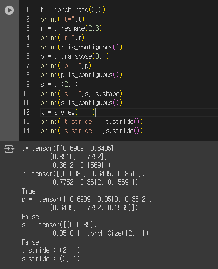
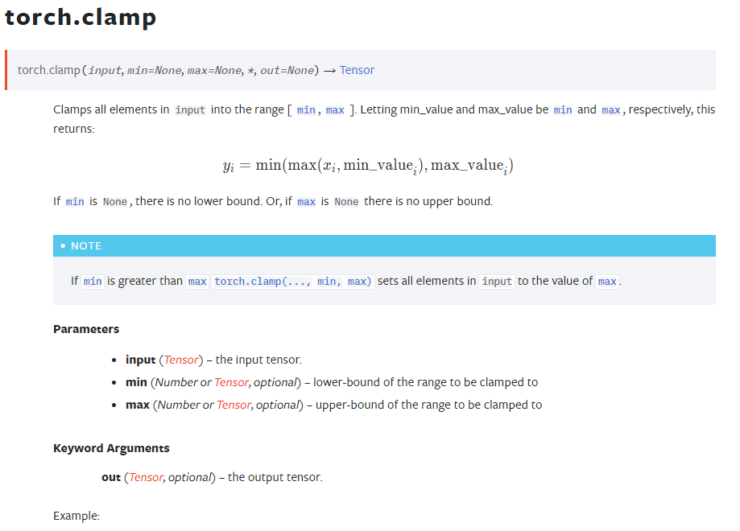

# Naver Boostcamp AI Tech 7기 Week 1 회고록

### 2024-08-05 회고

Pytorch에 관한 기본적인 내용이었다.

이미 pytorch의 기본 사용법들은 다 알고 있기에, 강의를 따라가는데 문제는 없었으나 마스터님이 적어준 Further Question에 대해서 고민을 하게 된다.

특히 여태 모델을 개발하면서 참고했던 코드들을 참고했을 때 weight initialization하는 과정에서 randn이나 rand가 자주 보였는데, 이번 강의를 수강하면서 다시한번 찾아보게 되었다.

> `torch.randn, torch.rand` 등 분포를 통해서 초기화를 하는 경우에 장점과 단점에 대한 Ref
>
> https://resultofeffort.tistory.com/114


### 2024-08-06 회고

어떤 캠퍼분이 질의응답으로 올린 글 중에 `contiguous` 하지 않는데, `view`  함수가 되는 경우에 대해 질문하셨다.

너무 간단하게 생각하고 질문에 답을 해서 잘못된 답을 했었는데.. 다음부터는 좀 더 고민하고 답글을 달아야겠다..

아무튼 그에 대한 다른 캠퍼분들, 마스터님의 답변은 다음과 같다.

[view_impl](https://github.com/pytorch/pytorch/blob/main/aten/src/ATen/native/TensorShape.cpp#L3363)을 확인했을 때, view의 가능 여부가 `stride`에 영향을 받는다고 명시되어 있다고 한다

즉, 텐서 메모리의 주소가 연속이기만 하면, 메모리가 등차수열?을 이룰 땐 view가 성립한다고 말씀하셨다. 

여기서 `stride`란 무엇인가? [참고 링크 #1](https://velog.io/@damab/pytorch-Contiguous-tensors), [참고 링크 #2](https://manywisdom-career.tistory.com/97), [참고 링크 #3](https://hiddenbeginner.github.io/deeplearning/2020/01/21/pytorch_tensor.html) [torch.view docs](https://pytorch.org/docs/stable/generated/torch.Tensor.view.html)

`stride`를 알기위해선 `storage` 를 알아야한다

`storage`는 tensor에 들어가는 데이터를 저장하는 물리적인 데이터

* 어떤 데이터 타입의 연속적인 **1D Array**

* 즉 어떤 차원을 가지든 메모리에 저장할 땐 1차원 배열 형태로 저장

`stride`는 차원에 따라서, 다음 요소를 얻기 위해 건너뛰기가 필요한 스토리지의 요소 개수

* 요소가 연속적으로 저장되어 있기 때문에, 행 중심으로 `stride`는 항상 1이다
* `stride` = (열방향으로 다음에 위치한 원소를 접근할 때 건너가야 할 인덱스의 수, 행방향으로 다음에 위치한 원소에 접근할 때 건너가야 할 인덱스의 수)

즉, `stride`가 일정한 상태로 sub Tensor가 구성이 되었다면, Contiguity-like Condition으로 판단 -> view 실행 가능



이런걸 잘 알고있으면, 굳이 reshape (추가메모리 할당) 없이도 shape 변환을 할 수 있다. (메모리절약)

> 추가 : stride() 함수로 stride 요소 간격이 일정한지를 판단하는건 적절X

---

in-place 방식이 메모리 효율이 좋은 이유는, 원본 데이터에 값을 변형시키기 때문이다.

하지만 기존 값들의 기록은 바로 사라져서, 사용할 때 조심히 사용해야한다

생각보다....과제 분량이 적으면서 많다.. 꽤 오래걸리네이거


### 2024-08-07 회고

피어세션에서 과제 관련해서 질문했었는데, 팀원분들이 나의 실수를.. 다들 캐치해주셨다.

무한한 감사..



`torch.clip, torch.clamp` 의 경우 `tensor`를 반환한다. 즉.. in-place가 아니므로, 꼭 변수에 저장해야 적용이 된다. 이처럼 함수에서 in-place 파라미터가 없고, output tensor를 반환한다면 꼭 변수에 저장하도록 하자

그리고 이번 강의를 들으면서 새로 배운 점에 대해 작성해본다

* 선형회귀모델을 학습시키고 난 뒤 model의 파라미터를 추출하고 싶은 경우에는 다음과 같이 해보자

  ```python
  model_info = model.state_dict()
  coef = model_info["linear.weight"]
  bias = model_info["linear.bias"]
  ```


### 2024-08-08 회고

SVM의 경우 결정경계를 그리고 Margin을 구하는데, 이때 Margin이라는건 결정경계가 가장 가까운 훈련 데이터들 사이의 거리?를 의미함 그래서 이 Margin을 최대화 하여 각 훈련 데이터들간의 카테고리를 분류하는 것인데, 선형 분리가 불가능한 문제에서도 되게 좋은 성능을 보였다

SVM은 클래스 간의 Margin을 최대화하는 결정경계(초평면)을 찾는 것을 목적

Logistic의 경우 선형회귀분석을 통해 데이터가 어떤 클래스에 속하는지에 대한 확률을 추정

* 손실함수도 svm의 경우 힌지손실함수를 사용함
* Logistic의 경우 Log-likelihood나 cross entropy를 사용함

---

BCELoss와 BCEWithLogitsLoss는 sigmoid를 붙인 Loss냐 아니냐의 차이이다.
근데 이 **Sigmoid를 붙이냐 안붙이냐의 차이가 수치적으로 안정성을 높이는 차이**를 가진다.

다중 분류의 문제에서는 BCELoss나 BCEWithLogitsLoss보단 일반 CrossEntropyLoss를 사용해서 이를 Softmax를 사용해서 0 ~ 1로 변환, 그리고 그 중 가장 높은 확률로 추정되는 class로 분류

조금 더 공부해야할 점 : Likelihood, 최대가능도함수.. -> CrossEntropy를 정확히 이해하기 위함


