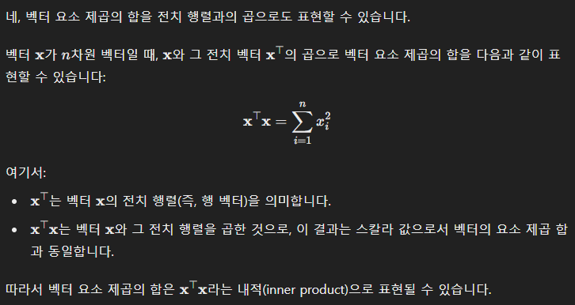
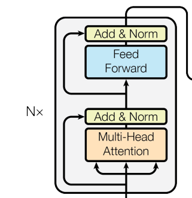
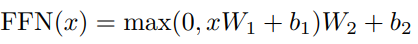
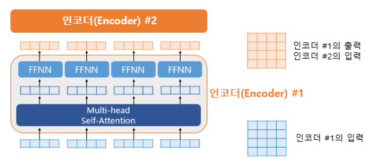
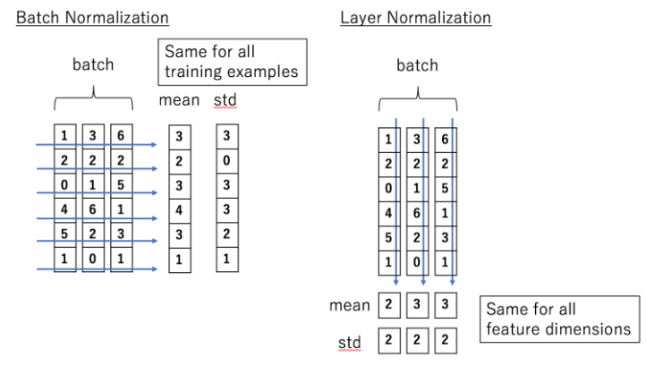

# Naver Boostcamp AI Tech 7기 Week 2 회고록

### 2024-08-12 회고

Numerical Instability in Softmax

우선 softmax의 함수는 다음과 같다.

$$p_i = \frac{e^{z_i}}{\sum_{j=1}^k e^{z_j}}, \quad \text{i = class}$$

* 여기서 exponential한 함수이기 때문에 매우 큰 값이 될 수 있고, 그 큰 값으로 나누게 될 수도 있다.
* 즉, 모든 클래스가 동일한 확률을 가지게 될 수도 있다는 것이다. (Unstable)

그래서 이를 방지하고자, 상수 $$C$$ 를 분모와 분자에 곱해서 shift하고, 이를 mapping하는 방법으로 문제를 해결한다.

여기서 $$C$$를 곱해주는 방법은 $$\log{C}$$로 곱해주는데, 이는 $$-\max(x)$$로 표현이 가능하고, 결론적으로는 입력값의 최댓값을 빼준다.

> 근데 왜 Log C가 -max(x)인지에 대해서는 잘 모르겠다.

```python
import numpy as np
def softmax(x):
    return np.exp(x) / np.sum(np.exp(x))

x = np.array([1.2, 2000, -4000, 0.0])
softmax(x)
# >> 0, nan, 0, 0

def modified_softmax(x):
    x = x - np.max(x)
    return np.exp(x) / np.sum(np.exp(x))

x = np.array([1.2, 2000, -4000, 0.0])
modified_softmax(x)
# >> 0, 1, 0, 0
```

> Reference
> https://jaykmody.com/blog/stable-softmax/
> https://dev-jm.tistory.com/30

**선형회귀의 가정에 대한 이야기**

이번 강의에서 선형회귀의 가정에 대해서 배웠는데, 좀 더 추가적으로 내 자신이 이해하기위한 내용을 작성하려고한다.

우선 선형회귀의 목적을 먼저 말하면, 알려진 데이터를 기반으로 알려지지 않은 데이터에 대한 값을 예측하기 위함이다. 예측하기 위해서 종속변수와 독립변수간의 선형관계에 대해 모델링이 필요하다.

근데 여기서 선형회귀모델을 정의할 수 있는 몇 가지 가정이 필요하다.

* 선형성
  * 독립변수와 종속변수간의 선형성 존재
    * 어찌보면 가장 당연한 이야기다. 선형성이 존재하지 않으면 의미가 없다.
* 독립성
  * 독립변수 간의 독립성
    * 다중회귀분석의 경우처럼 독립변수가 여러 개인 경우, A라는 독립변수가 B라는 독립변수와 상관관계가 존재한다면 종속변수와의 상관관계를 정확히 파악하기 어려워 모델링이 제대로 되지 않는 문제점이 있기 때문 (다중공선성)
  * 잔차 간의 독립성
    * 잔차간의 독립성은 단순하다. 잔차는 자체가 무작위성을 가지고 있다. 만약에 이전 잔차가 현재의 잔차에 영향을 미치면, 잔차에 대한 자기상관을 갖게되므로 모델링이 되지 않는다.
* 등분산성
  * 잔차의 분산들은 일정해야함
  * 이분산성 : 오차의 분산이 독립 변수 값에 영향을 받아서 변하는 경우를 의미함, 즉 독립변수의 값에 관계없이 오차의 크기가 일정해야함
* 정규성
  * 잔차들이 정규분포를 따라야함
    * 위 등분산성과 비슷한 이야기임
    * 신뢰구간 추정에 어려움이 있음 (신뢰성의 문제가 있음)


### 2024-08-13 회고

[OSL 공식 유도 참고](https://satlab.tistory.com/10)

강의에서 최소 제곱법에 대해서 간략하게 설명한 뒤로 과제를 하다가 궁금했던 부분을 정리하고자 한다.

최소 제곱법은 파라미터를 구하는 방법 중 하나

> 데이터와 잔차제곱의 합을 최소화 하도록 모델의 파라미터를 구함

수식은 다음과 같다.

$$E = \sum_{i=1}^n (y_i^e - y_i)^2 = ||y^e - y||^2 = ||Ax-y||^2$$

> 식을 보면 제곱을 떼면 L2 NORM 식이다

벡터 요소 제곱의 합은 **전치와의 곱**

> 이부분은 좀 이해하기 힘들어서 GPT의 힘을 빌림
> 

따라서 위 오차를 다음과 같이 표현가능

$$\begin{equation} \begin{split} E &=(Ax-y)^T(Ax-y) \\&= y^Ty-2y^TxA-A^Tx^TxA\end{split}\end{equation}$$ 

여기서 $$x$$에 대해서 미분하고, 그 결과를 0으로 놓아서 $$A$$에 대한 최적값을 찾는 것을 목적으로 함

$$ -2x^Ty + 2x^TxA = 0$$으로 미분되고, 최종적으로 $$x^TxA = x^Ty$$ 가 도출된다.

이것을 $$A$$에 대해서 풀어쓰면

$$ A = (x^Tx)^{-1} x^Ty$$ 이라는 결과가 나온다.

이걸 numpy로 풀어쓰면

```python
self.weights = np.linalg.inv(X.T.dot(X)).dot(X.T).dot(y)
```

로 그대로 풀어쓸 수 있다.

그럼 여기서 `np.linalg`는 무엇인가

`np.linalg`는 행렬 계산할 때 사용할 수 있는 여러 함수들을 가짐

`det` (행렬식) , `inv` (역행렬)


### 2024-08-14 회고

backward를 numpy로 구현하는 과정에서 궁금한 것들

np.dot

np.sum

(추가 업데이트 예정..)

과제가 어려웠어서 과제에 사용되는 역전파 하는 과정에서 np.dot, sum을 왜썼어야하는지..에 대해서 좀 더 정리가 필요하다.


### 2024-08-16 회고

### Position-Wise Feed-Forward Network



**Two Linear Transformations, ReLU Activation**



FFN 수식 (논문 발췌)

```python
class Feed_Forward_Network(nn.Module):
    def __init__(self, input_size, hidden_size, dropout):
		    super().__init__()
		    self.FFN_Sequence = nn.Sequential(
				    nn.Linear(input_size, hidden_size),
				    nn.ReLU(),
				    nn.Dropout(dropout),
				    nn.Linear(hidden_size, input_size)
				)
		def forward(self, x):
				return self.FFN_Sequence(x)
```

### **Feed Forward Network**

- Feed Forward Network는 간단하게 말하면 

  순방향

  으로 흐르는 Network

  - Recurrent, Backward 하지 않음

### **왜 쓰는거지?**

- 비선형 변환을 위함
  - 위 $FFN(x)$ 식을 참고하면, FFN에는 ReLU Function이라는 활성화 함수가 있는데, 이 활성화 함수 자체가 비선형적임
  - 비선형적인 관계를 학습하기 위함
  - FFN 이전까지의 과정이 선형적인 것은 아님
    - Self-attention에서 Softmax 함수를 사용함으로써 이미 비선형성을 포함
    - FFN은 이러한 비선형적 관계를 **더 강화하는 느낌**
- 모델의 안정성을 강화
  - Self-Attention에서 나온 Feature들에 대해서 중요한 정보는 강조하고, 비교적 낮은 정보들은 약하게 만듬

### Position-Wise?

- 각 단어(Token)마다 개별적으로 적용한다는 의미에서 Position-Wise라고 부름

  

## Layer Normalization

일반적으로 여러 모델들을 보면 Batch Normalization을 쓰는 것을 볼 수 있음

하지만 Transformer에서는 Layer Normalization을 사용함, 그 이유와 무슨 역할을 하는지 알아보쟈



Batch Norm

- 각 **Feature**의 평균과 분산을 구해서 **Batch에 있는 각 Feature들을 정규화**
- 예시) 1,3,6에 대한 평균과 분산을 구하고 1,3,6을 Normalization함
- 배치에 영향을 받음

Layer Norm

- 각 **Sample의 Feature**들에 대한 평균과 분산을 구해서 **Batch에 있는 각 input을 정규화**
- 배치에 영향을 받지 않음 (배치크기 상관X)

**왜쓰는가?**

- 데이터의 가변성
  - 배치 크기 내에서 여러 데이터가 있는데, Sequence 즉 문장의 경우 입력의 길이가 다 다르기 때문에, Layer Norm이 선호됨
- Context
  - NLP의 경우 단어들의 순서나 관계들이 중요한데, 그러한 정보들을 잃지 않고 정규화가 가능

참고

* https://velog.io/@aqaqsubin/Transformer-Attention-Is-All-You-Need

* https://medium.com/@punya8147_26846/understanding-feed-forward-networks-in-transformers-77f4c1095c67

* GPT-4.0o

* https://yonghyuc.wordpress.com/2020/03/04/batch-norm-vs-layer-norm/

* https://dongsarchive.tistory.com/74

