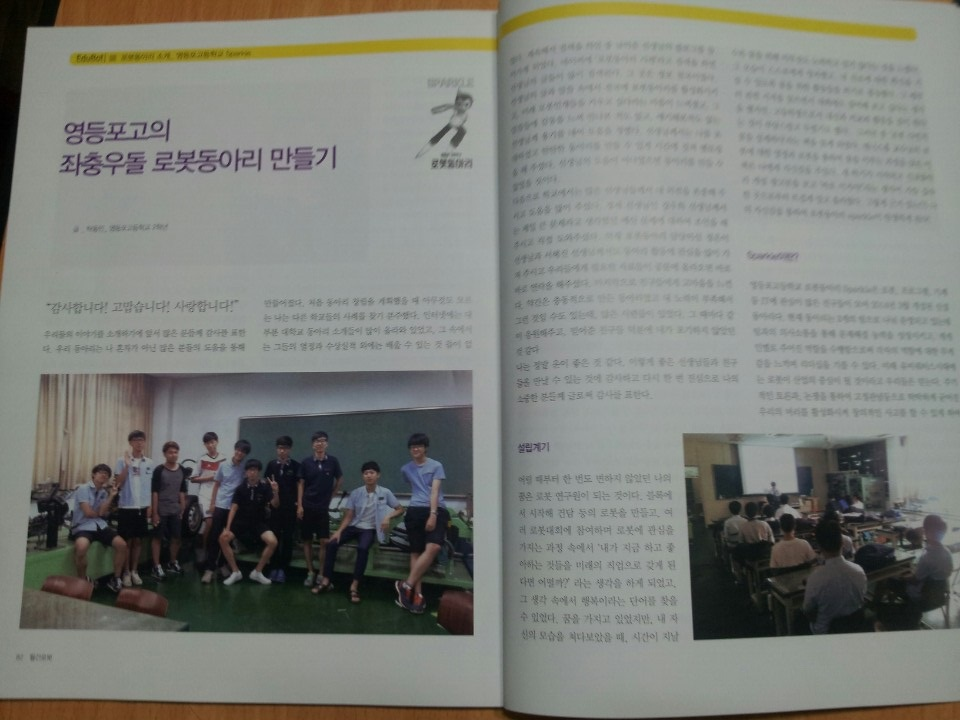

# 삶의 지도

이력서를 쓰는 과정에서 "역량"에 대해서 쓰고 있는 도중에, 생각보다 내 역량이 뭐였지.. 난 뭐가 잘했지.. 난 어떤 사람인거지??하며 혼란을 겪고 있는 시간이 길었다. 

사실.. 부스트 캠프에서 변성윤 마스터님이 이력서를 작성하기 전 **<u>"삶의 지도"는 꼭!!! 작성해보고 시작했으면 좋겠다.</u>** 라는 말씀을 하셨지만 기간안에 빠르게 제출하기 위해.. 이력서를 먼저 써보고.. 지금에서야 삶의 지도를 작성해본다..

나의 삶의 지도는 "어떤 것을 시작 한 시점"을 기준으로 작성해보려고 한다.

## 컴퓨터 전공할래!

나는 사실 피아노를 전공하고싶어서 초등학생 1학년때부터 중학생 2학년까지 피아노를 했었다. 이때까지만해도 나는 내가 피아노를 잘 치는 줄 알았다. 근데 막상 콩쿨같은 곳을 구경가서 나랑 비슷한 나이대 친구들을 보자마자 의지가 꺾였다. 예체능의 천재는 따라잡을 수가 없다는 것이 진짜였다는걸 깨닫게되는 순간이었다.

생각보다 빠르게 내가 하고싶은 것들을 다시 찾게될줄은 몰랐다. 심지어 체육계(배드민턴)도 고민해봤다. 역시 그마저도 천재들을 따라잡을 순 없었다.

그러다가 중학교 한 친구가 "너 그럼 컴퓨터는 관심있냐?"라는 말에 단순히 초등학교 방과후학교에서만 들었던 것들을 생각해보았었다.

* ITQ 자격증 전부 취득
* 컴활 3급 (그때 당시엔 3급이 있었다!)
* 한자 4급
* 타자 500타(?)

물론 코딩과는 관련이 없지만, 그때 당시 컴퓨터관련한 자격증을 취득할 때를 생각해봤었다.

생각해보면 그 시절에 나는 게임을 정말 좋아했었는데, "바람의나라", "메이플스토리" 이런 RPG게임류를 정말 즐겼다. 그리고... 불법이지만 "프리메이플", "프리바람의나라"를 구축하기 위해 그때 당시 Java도 뭔지도 모르는데 설치하고 MySQL도 뭔지도 모르는데 설치하고.. 지금 기억이 안나는데 js도 해보게 된 것 같다. 그래서 실제로 구축이 잘되면 정말 기뻐했고 뜯어보기도 했었다.

이런 기억들이 살아나면서 그때부터 "개발자"에 대한 꿈을 키웠고, 중학교 3학년 때 컴퓨터 특성화고로 유명한 "선린인터넷고 체험학습"을 참여하게 됐었다. 그때 아마도 내 기억상으로는 성적이 내신 2.0 이하이거나, 코딩테스트를 보거나.. SW 학과 체험은 좀 들어가기가 어려웠다. 나는 알고리즘같은건 풀지도 않고, 풀수도 없었던 때이기도 했고 멀티미디어학과 체험학습만 하고 마무리하게됐어서 많이 아쉬웠었다..

그래서 고등학교를 실업계(특성화고) 고등학교를 가기를 희망했으나 부모님의 강력반대로 인해 나는 강제로 인문계 고등학교에 갔었다. 근데 그때 생각하면 실업계 고등학교의 이미지는 정말 안좋았었고.. 인문계로 가서 4년제 대학을 가는게 더 좋았기 때문에 반대를 하신게 아닐까 싶다. 그렇게 고등학교는 인문계 고등학교로 가게 되었다

## 로봇 동아리

나는 고등학교 들어가기 전부터 이미 뭘 하고 싶다고 선생님들께 이야기를 했었다. (이쪽으로 잘 밀어달라고 어필했었음..ㅎ)

그러다 마침 기계쪽에 관심을 가지고 있던 친구들이 있었고 나는 SW개발, 친구들은 기계쪽, 이렇게 총 3명이서 로봇동아리를 만들었었다.  

이때 당시 돈도 없던 우리는 부모님을 설득해서 "레고 마인드스톰 (ev3)"를 총 3세트를 사고 소프트웨어 라이센스도 사고, 교육도 돈주고 들었다. 그리고 담당 선생님도 설득해서 구하고 해서 제대로 개발, 알고리즘쪽에 관심을 갖게된 계기가 되었다.

그래서 로봇관련 잡지에도 우리 동아리 얘기도 실리고 더 많은 부원들이 들어오게 되었고 좋은 후배들에게도 잘 물려줄 수 있게 되었다.

>  나중에 후일담으로 이 동아리는 이런저런 대회에서 우승했다고 한다..! 후배들 대단한듯;;

## 상명대학교 미디어소프트웨어학과

취업, 입시에는 정말 운이 크게 작용한다는 것을 지금도 그렇고 예전에도 크게 느꼈다.

나는 상명대학교라는 곳을 넣을 성적도 되지 않을정도로 성적이 그리 좋지 않은 학생이었다. 

그래서 대부분 학생부종합 (자소서 + 면접 + 내신)으로 대학 입시를 했었는데, 그때 정말 한것이라곤 로봇 동아리말곤 없었다. 하지만 내가 하고싶은건 명확했다.

* 로봇 동아리에서 경험한 센서처리 경험으로 IoT 스마트홈 센서처리 개발
* 스마트홈을 제어할 수 있는 스마트폰 Application 개발

> 다 로봇 동아리를 하다가 생각한 것들이다. 이런저런 것들을 만들다보니 "내 생활을 편하게 만들 수 있는 것들이 뭐가 있지?"를 생각을 많이했었다. 그런 생각들이 주로 집을 보면서 생각했고 그래서 스마트홈쪽을 개발하고 싶다는 생각이 많이 들었다. 

근데 1차 서류도 붙어서 2차 면접을 갔을 때 '이게 되나....' 싶었다. 그런데...정말 놀랍게도 상명대학교 미디어소프트웨어학과 최초합이 되었고 수능 2일 전 수시합격자가 되었다.

> 수능은 걍 놀러갔었음...ㅎ

후일담으로는 이때 교수님이 마침 ev3 마인드스톰에 관심을 갖고 있던 분이셨고, 실제 그걸로 수업도 하셨던 분이었던 것이다. 정말 운이 좋았다.

학교를 다닐 당시에는 "영상 제작 동아리"와 "어쿠스틱 밴드 동아리" 활동을 저어어엉말 열심히했다. 그러다보니 내가 원했던 것들을 할 시간보다 학교 활동을 더 많이했었다...

그렇게 학교에서 수업과 동아리에만 충실하게 열심히 한 뒤... 군대 갔다오고 난 다음 "학부연구생"으로 연구실을 들어갔다.

## 학부 연구실 생활

2년의 학부 연구생, 2년의 석사과정의 연구실 생활을 겪었다.

이전 학교를 들어오기 전 생각했던 "IoT"의 꿈은 2016년(1학년..) 기점으로 많이 변했다.

알파고로 인한 인공지능의 보급이 시작되면서 인공지능 열풍이 시작되었다. 그렇게 나도 트렌드에 맞춰서 목표를 변경했다

* 머신러닝/딥러닝을 사용한 IoT 센서 자동화 처리

이런 것들을 배우고 싶어서 자대 연구실을 찾게되었고, 학부 연구생으로 프로젝트를 하게 되었다.

하지만 내가 생각했던 연구실과 달리 대부분 내가 원하는 것들을 할 수 없었고 전혀 다른 분야를 하게 되었다.

* 전력 데이터 분석
* object detection, Segmenetation..

그래서 연구실에 있는 박사님과 얘기를 해서 연구실 내 중점으로 하고 있는 분야를 따라가보려고 했다.

* 생체신호기반 감정 분류

## 1년간 길을 잃다

그렇게 생체신호처리 모델 개발을 목표로 대학원을 들어왔지만, 컴퓨터학과 출신인 내가 생체신호에 대해 잘 알리가 없었다.

그래서 정말 원초적인 생체 신호 발생원리부터 시작해서 다양한 필터, 신호 분석 등 기초적인 것부터 공부하기 시작했다.

그 중 ECG(심전도)를 공부했었는데, 여러 신호 중 ECG를 선택한 이유가 있었다.

* 신호가 명확하다.
  * 심장의 신호는 모두가 알듯이 PQRST로 두-근! 하고 뛰는 것을 알 수 있다. 하지만 EEG (뇌전도) 신호의 경우 정말 미세한 변화를 감지해야하는 어려움이 너무 컸다. (+ 데이터가 없다..)

* 심장은 다양한 요인으로 인해 변화가 생기고 그게 신호로 보인다.
* 가장 기본이 되는 신호다.

하지만, 생소한 도메인을 배우기 위해서는 "데이터"가 많이 필요한데, 우리 연구실에서는 그런 데이터를 측정할 도구도 없었고, 다른 연구기관과의 인연도 없었다.

단순히 open dataset (physionet)으로만 공부만 했어야 했었고, 아이디어 또한 많이 생각하기 어려웠다. 연구가 아닌 공부만 할 수 있었다.

그렇게 1년이 흘렀고 아무런 성과도 낼 수 없었다.

심지어 어쩌다보니 랩장이 되어서 사람관리, 돈관리, 교수님의 여러 일들..이런것들만 처리하게 되었다.

그래서 이때 내가 무엇을 할지에 대해 다시 한번 고민해봤다.

* 정말 이 ECG 공부를 살릴 수 있을까?
* 지금 내가 하던거에서 뭘 할 수 있을까?
* 내가 이길로 쭉 가게된다면 뭐가 될 수 있을까?

이런 생각을 거치게되었을 때, **"일단 GO"** 라는 생각을 했다.

생각해보면 공부했던 것을 기반으로 **<u>Deep Learning을 써서 제대로 해본 경험이 없었다</u>**라는 것이다. 그래서 아직 이 분야를 함으로써 얻는 한계점을 최대로 못느낀 것도 있다. 그리고 **<u>내가 1년동안 공부한 것들을 두고서 아무것도 못하고 포기할 수는 없었다. 적어도 끝까지 경험해보고 후회하자!</u>** 라는 생각을 가지고 다시 마음을 잡고 시작하기로 했다.

## 졸업과 입학과 포기

연구실에 ECG를 측정할 수 있는 장비도 생기고, 같이 연구했던 박사님도 Post-Doc을 끝내고 돌아오셨다. 그래서 정말로 이제는 우리가 하고싶은 것들을 제대로 할 수 있게 되었고 원하는 실험도 다 할 수 있게되었다.

하지만 이때의 나는.. 거의 졸업논문을 쓰는 시기였다. 무언가를 더 하고싶다는 마음을 가지고 있었고 꼭 그러고 싶었다.

그래서 현재 있는 곳의 박사과정을 시작해서 좋은 논문을 써보자!!라는 마음으로 박사 과정을 지원했고 면접까지도 보고! 합격까지도 됐다.

여기서 일이 벌어졌다.

졸업논문 제출시기와 등록금 제출시기가 겹쳐서 깜빡하고 등록금을 내지 못했던 것이다... 그렇게 입학 취소가 되었다...

순간 이게 맞는 것인가? 하면서 패닉에 빠졌고 취업을 할지 한학기 동안 무보수로 연구실을 출근하고 박사과정을 이어갈지에 대해 정말 많은 고민을 했고 많은 사람과 이야기를 나눴다.

근데 모두가 **<u>너 지금 박사과정해서 정말로 하고싶은게 뭐야?</u>** 라는 질문을 나에게 했다.

생각해보면 내가 박사과정을 하려는 이유가 정말 내가 연구가 좋아서, 연구를 하고 싶어서 박사과정을 하려고 하는가?에 대한 질문을 항상 명확하게 대답을 못했었다.

내가 이곳에 남는다고해서 나의 커리어가 더 좋아질 것이라는 생각이 들지 않았다. 현재 내가 개발한 것들과 졸업 논문과 종합해봤을 때 이 곳에 남는 것이 더 우물안의 개구리가 될 것 같은 생각이 들어, 그렇게 연구실을 나왔다.

## 높은 취업의 벽

취업의 시작은 이력서 작성과 포트폴리오 작성부터 시작된다고 생각한다.

그렇게 하나하나 내가 뭐했는지, 뭘 할 수 있는지 적기 시작했는데.. 적고보니 남는게 없었다.

일관된 프로젝트가 아닌 중구난방 분야의 프로젝트, 즉 얕고 넓은 프로젝트만 진행해본 사람이 되었다.

그렇게 내가 지금 한걸로 원하는 곳으로 갈 수 있는 곳이 없다는 것을 깨닫고 다른 플젝을 쌓아보자 라는 생각을 했다.

그러던 중 네이버 부스트캠프가 눈에 들어왔다.

## 새로운 시작

학부생때 정말 해보고 싶었던 것이 네이버 부스트캠프와 같이 외부 코딩 프로젝트 활동이였는데, 마침 딱 쉬는 시기에 지원 시기였었다.
그래서 새로운 주제로 공부를 다시 시작할 수 있다라는 희망을 안고 지원을 했다.

그리고 신청을 한 결정적인 이유가 있다.

* **<u>정말 아무것도 신경안쓰고 코딩하고 프로젝트에 전념해보고 싶다.</u>**
* 어떤 새로운 기술을 배울 때 바로 즉각적으로 프로젝트로 적용해볼 수 있는 기회

아무래도 연구실에서 잡다한 일들이 많이 생겨서 정말 코딩만, 공부만 해본 경험이 많이 없다. 그래서 이번 기회에 아~~~~무것도 신경 안쓰고 공부, 플젝만 하고 싶다는 생각으로 신청했다.

분야는 NLP로 결정했다.

이전에 졸업논문 쓸 때 Transformer 기반으로 생체신호 처리를 해보았는데, 논문 찾으면서 자연스럽게 자연어 처리(NLP) 논문도 읽게 되었다. 그때마다 이 분야도 많은 도메인에서 사용되고 앞으로도 쭉 서비스가 생겨날 것 같아 재밌을 것 같다는 생각을 했어서 NLP로 결정했다.

## 세상엔 잘하는 사람이 너무 많다

부스트 캠프를 하는 중에 크게 느꼈다.

난 정말 **<u>우물안의 개구리</u>** 였다.

초기에 자기소개를 하면서 여러 사람들의 Github을 보았었는데,

나보다 어리고 아직 석사도 안한 친구들이 나보다 좋은 프로젝트도 많이했고 경험도 많은 것을 보았다.

여기서 조금 주눅들었지만, 일단 나는 이래나 저래나 석사를 했고, 다른 친구들이 경험해보지 못한 것들도 경험해 보았다고 생각한다.

그래서 부스트캠프 중 나의 목표는 다음과 같이 정했다.

* 현업에서처럼 프로젝트하기

* 앞으로 나서서 하자

  > 붓캠 출신 친구가 따라가는 것보다는 나서서 하는 사람이 더 잘했다고 한다

* 많은걸 시도하되 한가지 할때에는 그것에만 집중하자

* 정리를 잘해보자

* 생각을 멈추지 말자

이렇게하다보면 나도 여기 있는 친구들만큼 올라갈 수 있을 것이라고 생각했다.

## 앞으로의 나

지금의 나는 이렇게 나눌 수 있을 것 같다.

### 커뮤니케이션 및 리더쉽

랩장을 3년간 하기도 했고 회사와의 커뮤니케이션도 해보고, 학부생 시절이나 지금 부스트캠프 플젝하면서 나는 주로 팀장을 맡아서 했다.

최대한 나서서 팀원들과 의사소통하며 프로젝트를 관리하려했고, 일정대로 마무리하려고 노력했다. 

그리고 독단적으로 결정하지 않았다. 항상 팀원들에게 물어보며 이게 나은지 저게 나은지 확인했고 팀원들이 한 작업에 대해서 적극적으로 피드백했다.

이러한 능력으로 새로운 팀을 만나도 프로젝트를 이끌어갈 수 있다고 생각한다.

다만 아직 전체적인 숲을 바라보는 능력이 부족하다고 생각한다. 좀 더 해야할 Task들을 세분화하고 팀원들의 능력을 기반으로 일정을 짜고 관리해야겠다.

### 문제 해결력

어떤 문제가 있다면 그거를 어떤 방식으로든 해결하려고 한다.

