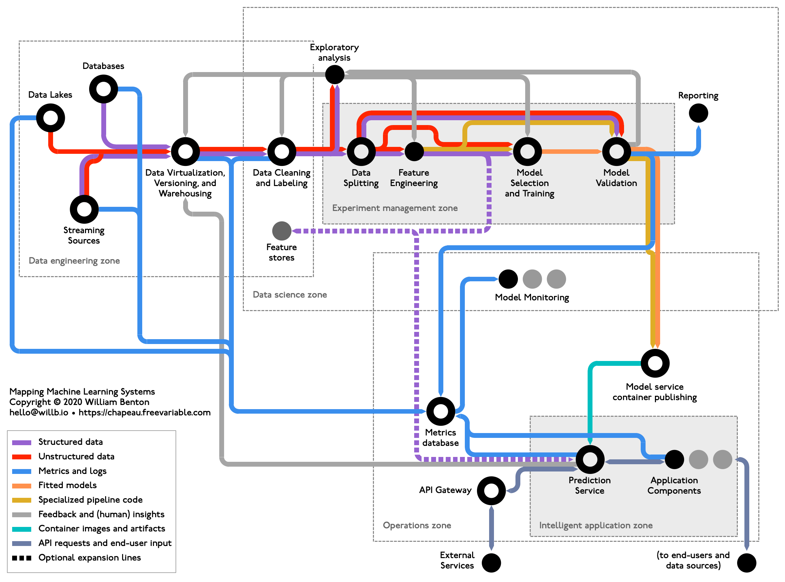
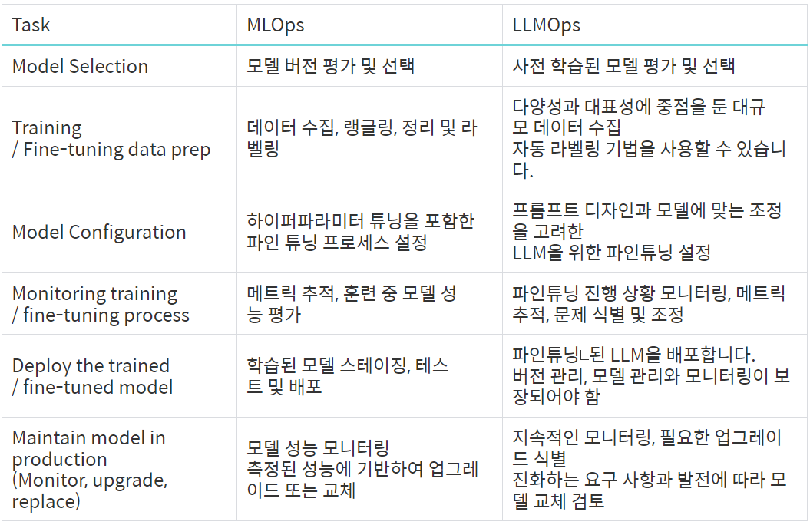

# MLOps 개념 정리 - 춘추전국시대 내용 요약

### MLOps

- ModelOps + DataOps + DevOps
- 생겨난 이유
  - 이 모델을 어떻게 서비스에 쓰지?
  - 버전관리는?
  - 사용된 데이터셋의 버전관리는?
  - 실제 서비스와 학습에 쓴 데이터가 다른데..?
  - 인프라 어케하지?
  - 언제 다시 학습?

모델이 많이 없다면 굳이 MLOps를 할 필요는 없다, 여러개일수록 임팩트를 가짐

### Component

- Serving : 프로덕션 환경에서 사용할 수 있도록 모델 배포

  

  - Batch 단위로 Serving / API 호출시 Serving
  - Airflow, Cronjob등으로 스케쥴링
  - Kubeflow, BentoML, Seldon Core, Cortex, KFServing, TF Serving, Torch Serve
    - 간단하게 구현하려면 Flask나 Fast API등을 써도되나, 그 후엔 Serving Framework로 옮겨가는 추세

- Experiment, Model Management

  - Research 단계에서 만들어진 Model Artifact들을 매번 기록, 관리

    > Model Artifact : 학습하는 과정에서 생기는 이미지, 모델 파일

    Monitoring Dashboard가 필요 → 특정 메트릭이 제일 좋은 것을 선택하는 기능 필요

  - MLFlow를 주로 사용하는듯

  - Uber의 경우 Model Selection Rule이 존재

- Feature Store

  - ML Feature를 집계한 Storage
  - Research랑 production 환경에서 모두 사용할 수 있도록 Store를 구성
  - 재사용을 가능하게 만들기 때문 (시간 비용 절약)
  - 두 환경에서 동일하게 사용할 수 있게 구성하는 것이 핵심임
  - SageMaker, Vertex.. Feast, Hops works
  - 프로덕션에서도 실시간 데이터를 빠르게 받을 수 있는 것이 핵심

- Data Validation

  - 양쪽 환경에서의 Feature의 Distribution을 확인해야함
    - Data Drift
  - Feature Store가 있으면 크게 문제되지 않음
  - FrameWork가 많이 없음
  - TFX, Evidently (Data Drift)

- Continuous Training

  - New Data, Batch time, Metric, call…등등
  - CI/CD/CT 같이 진행해야함
  - Uber의 Action Rule → Metric 기반

- 그 외…

  - GPU Infra
  - Monitoring
  - AutoML
  - Model Validation

> CI/CD/CT , Cloud, k8s 에 대해서 잘 알고 있으면 좋을 것

기본부터 차근차근…

## 추가로 알아본 LLMOps

LLM (Large Language Model)을 “주”로 하는 MLOps를 일컫는다.

MLOps와 대부분 하는 일은 같으나, 큰 크기와 복잡성 때문에 특별한 Process가 필요 → LLMOps의 복잡성과 리소스 요구사항을 중점적으로 다룸

그래서 일반 MLOps과 다른 특화된 접근 방식이 필요

### 주요 구성요소

- Model FineTuning, Management
  - Pre-trained된 LLM에 Fine Tuning 수행 → 데이터 품질, 다양성 관리
- Scaling
  - LLM은 Parameter가 수억개가 넘어가므로, Resource가 많이 필요함
  - 분산 처리, 인프라 최적화 등 작업
- Service
  - 대부분 API를 기반으로 Application에 활용되기 때문에, API 관리를 필요로함
- Monitoring
  - 실시간 모니터링, Model update 등 성능 유지
- Ethical Considerations
  - LLM이 편향된 패턴이 있을 수 있음 → 지속적으로 평가, 관리 해야함

### MLOPS와 LLMOps의 차이

- 모델 크기
  - MLOps의 경우 전반적으로 모든 모델을 다 다루지만 LLMOps의 경우 대규모 언어 모델에 중점을 두기 때문에, 더 많은 computing Resource가 필요함 (특수한 GPU,TPU)
  - 특히 인프라 요구사항이 높음
- Transfer Learning
  - 기존 모델 기반으로 특정 도메인에 대한 학습을 함 (Fine-Tuning)
    - Parameter-Efficient-Fine-Tuning(PEFT)
    - Retrieval Augmented Generation(RAG)
    - 최근엔 RAG를 좀 더 주로 사용하고 있음
  - Prompt Design과 Model에 맞는 Fine-tuning이 필요로함
    - 즉 Prompt Engeineering / Tuning이 필요
- Human Feedback
  - 사용자 피드백에 크게 의존
  - 자연스러운 문장이나 연관성이 있는 내용을 생성해내는지 성능평가가 필수
  - 피드백 → 모델 반영 → 성능 향상, 따라서 반영 가능하게 파이프라인 설계
- Production
  - MLOps의 경우 web, mobile에 사용되거나 특정 응용프로그램에 통합
  - LLMOps의 경우 API를 통해 주로 제공되기에, API 호출과 관련된 관리도 필요함

> 따라서 대규모 언어모델을 어떻게 배포할 것이며 어떻게 최적화 시킬건지에 대해 고민함
