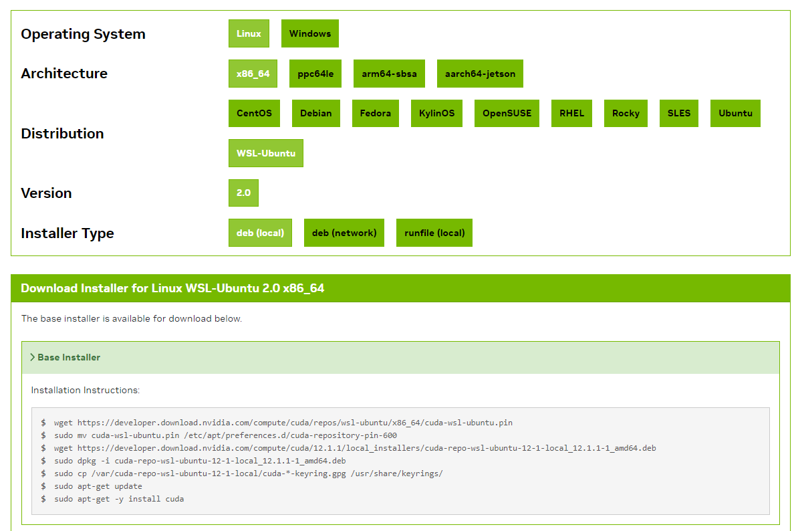

# MLOps WSL2 설정과 Nvidia-Docker 설치 (1)

Ubuntu를 따로 설치하기가 힘들고.. 그럴만한 하드나 그런것들이 없기에... WSL2랑 Docker를 설치해서 해보려고한다.

따라서!!!! 오늘은 WSL2를 만들고 Nvidia-Docker를 깔아보는 것을 목적으로 한다.

## WSL2 설치

우선 Windows 기능부터 키자

켜줄 목록은 다음과 같다.

* Hyper-V
* Linux용 Windows 하위 시스템
* Windows 하이퍼바이저 플랫폼
* 가상 머신 플랫폼

그리고 다시시작하기... (덕분에 찾아놓은 크롬 탭들을....^^)

다시시작하고 돌아와서 WSL1과 WSL2 중 ver2를 선택해야한다

~~~shell
wsl --set-default-version 2
~~~

### 1. WSL2 Ubuntu 20.04 LTS 설치

윈도우 Microsoft Store에서 WSL용 Ubuntu 20.04 버전을 다운받기

설치가 완료되면 일단 열어보자

그러면 사용자 이름과 비밀번호를 설정하라는 문구가 나온다

설정하면, Ubuntu CLI 상태의 형태가 나온다!

### 1-1. WSL2 설치 위치 변경

기본적으로 WSL2는 C드라이브에 설치된다.

이미.. 나의 용량은 게임으로 인해 C드라이브가 꽊꽊ㄲ....

따라서 HDD로 ubuntu 드라이브인 `ext4.vhdx` 를 옮기고자 한다.

#### **(1) export & import**

우선 현재 있는 ubuntu를 `tar`파일로 빼고 다시 import를 한다

~~~shell
// file: "powershell"
e:\ubuntu> wsl --export Ubuntu-22.04 ./exp_ubuntu.tar
e:\ubuntu> wsl --import ubuntu2204 ./exp_ubuntu.tar ./
~~~

현재 폴더에 `ubuntu2204.tar` 파일로 ubuntu-22.04를 추출하고, 현재 폴더에 추출했던 `tar` 파일을 다시 임포트해서 다음과 같이 적용

#### (2) unregister

~~~shell
// file: "powershell"
e:\ubuntu> wsl --unregister Ubuntu-22.04
e:\ubuntu> wsl --set-default ubuntu2204
~~~

원래 등록되어있던 Ubuntu-22.04를 제거하고 새로 임포트한 ubuntu2204를 wsl 실행시켰을때 나오는 default Version으로 설정함

추가로, 이렇게 D드라이브로 옮겨서 실행시킨 경우 root로 기본 User로 설정되어있는데,

이를 WSL2 내 `/etc/wsl.conf`에 추가시킨다

~~~shell
// file: "/etc/wsl.conf"
[user]
default=jeonghwi
~~~

이렇게 하면 최종적으로 wsl 설정 완료

(Starting Directory 설정은 추후에 설정 예정)

### 2. WSL에서 Cuda 설치

우선 Nvidia-Driver (Studio)로 설치 (for WSL2) 

* 이 과정은 스킵

Cuda Toolkit은 현재 Pytorch 최신버전에 맞춰서 12.1로 설치

이렇게 Cuda Toolkit 까지 설치 완료

PATH 설정은 [블로그](https://velog.io/@cjkangme/WSL2%EB%A1%9C-CUDA-%ED%99%98%EA%B2%BD-%EC%84%A4%EC%A0%95%ED%95%98%EA%B8%B0-CUDAcuDNN-%EC%84%A4%EC%B9%98%EA%B9%8C%EC%A7%80)를 참조했음!

~~~shell
// file: "~/.bashrc"
function _switch_cuda {
   v=$1
   export PATH=$PATH:/usr/local/cuda-$v/bin
   export CUDADIR=/usr/local/cuda-$v
   export LD_LIBRARY_PATH=$LD_LIBRARY_PATH:/usr/local/cuda-$v/lib64
   nvcc --version
}
~~~

~~~shell
$ source ~/.bashrc
$ _switch_cuda 12.1
~~~

### 3. Nvidia-Docker 설치

추후에 MLOps for all 강의에서 Kubernetes를 사용하게되는데, 그때 버전을 좀 맞춰서 설치하는 것 보다 MLOps for MLE 강의에서 미리 설치하고 넘어가자

Docker는 20.10버전...인데 현재 27.2.0 버전을 설치했다...

나중에 트러블슈팅하자..

>  Reference

https://wikidocs.net/book/10445

https://jakupsil.tistory.com/45

https://lolz0309.tistory.com/9

https://velog.io/@cjkangme/WSL2%EB%A1%9C-CUDA-%ED%99%98%EA%B2%BD-%EC%84%A4%EC%A0%95%ED%95%98%EA%B8%B0-CUDAcuDNN-%EC%84%A4%EC%B9%98%EA%B9%8C%EC%A7%80