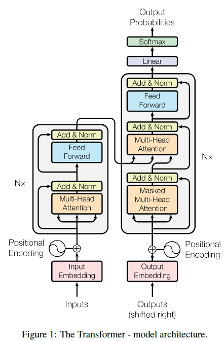
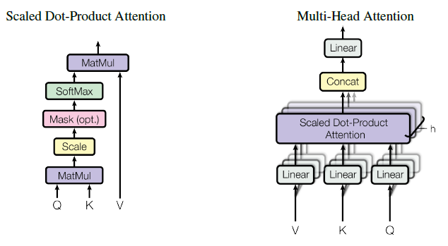
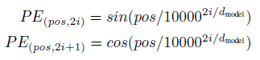
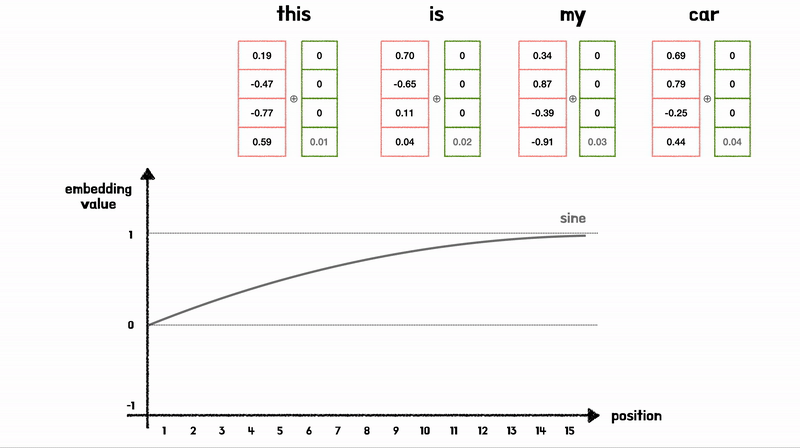
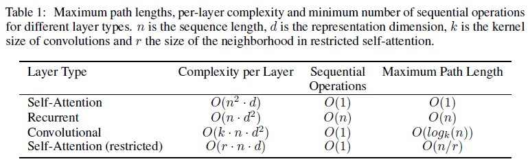
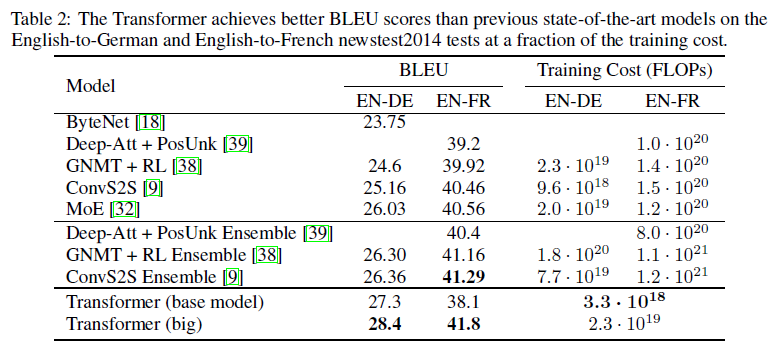
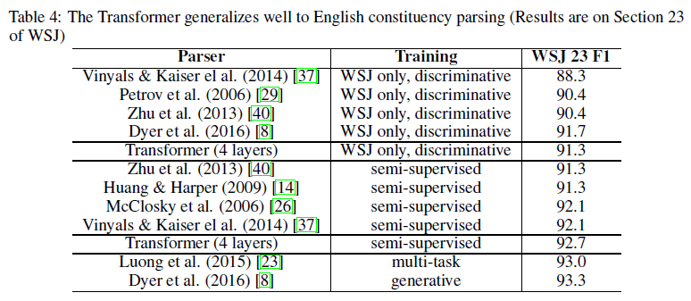

# Attention is All you Need (2017) Review

> 영어를 그다지 잘하지 못하는 편이라 오역이 있을 수 있습니다


2017년에 google에서 나온 "Transformer"라는 논문입니다.

AI기술에 큰 전환점이 되는 논문 중 하나입니다.

현재 모든 분야에서 안쓰이는 곳이 없는 기술이기에 꼭 한번 리뷰해보심을 추천드립니다!

[참고한 코드](https://github.com/hyunwoongko/transformer/tree/master/models)

## Abstract

대표적인 Sequence Transduction 모델들은 Encoder-Decoder 구조로 되어있는 복잡한 CNN, RNN을 기반으로 함. 그 중에서도 Attention Mechanism을 사용하는 모델이 가장 좋은 성능을 보임

저자들은 복잡하게 구성되어있는 모델대 대신에 간단한 구조로 이루어진 새로운 모델을 제안

"Transformer, based solely on Attention Mechanisms, dispensing with recurrence and convolutions Entirely"

{:.note title="Original Text"}

Attention Mechanisms만을 사용한 모델로, 병렬화를 할 수 있고 학습 시간도 줄일 수 있을 뿐만 아니라 성능도 좋았다고 함

WMT 2014 영어-독일어 번역 task에서 BLEU (Bilingual Evaluation Understudy) 28.4를 기록, 그리고 총 8개의 GPU를 사용해 3.5일동안 학습시킨 뒤 영어-프랑스어 번역에서는 41.8로 SOTA급 달성함

Large, Limited Data에 대한 English [constituency parsing](https://ok-lab.tistory.com/57)에 성공적으로 Generalizing함을 보였음


## Model Architecture



우선 Abstract에서도 얘기했듯이, Attention만을 사용한 Model Architecture를 보여준다. 그리고 Point-wise, Fully Connected Layer를 encoder와 decoder에 다 사용한다.

그리고 다양한 변수들을 다음과 같이 정의한다.

Symbol Sequence (input) : $$(x_1, x_2, ... , x_n)$$

Continuous Representation : $${z}=(z_1,z_2,...,z_n)$$ 

output sequence : $$(y_1,y_2,...,y_n)$$


### Encoder-Decoder Stacks

#### Encoder

논문에서는 6개($$N=6$$)의 Block으로 구성되어 있고, 각각의 Block안에는 2개의 sub-Layer로 구성되어 있다

* Multi-Head Self-Attention
* Position-wise Fully Connected Feed-Forward Network

그리고 Residual Connection, Layer Normalization을 사용했다.

`Add & Norm` 으로 되어있는 Layer는 $$LayerNorm(x+\text{Sublayer}(x))$$를 갖는다.

Residual Connection을 하기위해서 Embedding Layer와 sub Layer들의 output의 차원은 $$d_{model} = 512$$로 구성했다.


#### Decoder

Encoder와 동일하게 6개의 Block으로 구성되어 있으나, sub layer는 3개로 구성되어 있다.

* <u>Masked</u> Multi-Head Attention
* Multi-Head Attention
* Feed-Forward

Masked Multi-Head Attention은 뒤에서 설명

### Attention (★)



#### Scaled Dot-Product Attention

Query, Key, Value 그리고 Output은 모두 Vector로 구성되어있고, 

Output은 value들의 weighted sum으로 계산되며.. 

Weight는 Query와 그에 상응하는 Key와의 Compatibility Function에 의해 계산됨

> $$d_k$$ : Query, Key의 차원
>
> $$d_v$$ : Value의 차원

$$
\text{Attention}(Q,K,V) = \text{softmax}(\frac{QK^T}{\sqrt{d_k}})V
$$

Additive Attention이랑 Dot-Product Attention 방법이 있는데, 그 중 이 논문에서는 Dot-Product Attention을 사용했다.

Dot-Product가 더 빠르고, 공간효율성이 더 좋지만, 작은 차원($$d_k$$)를 가질 시에는 두 방법 모두 비슷하다. 큰 차원을 갖게되면 오히려 Additive Attention이 좋아진다.

>  $$d_k$$가 증가하게되면 softmax 값 자체가 매우 작아지게 되는데, 이렇게 되면 학습이 제대로 되지 않기 때문임

그래서 저자들은 $$\sqrt{d_k}$$로 나누어서 Scailing하여 고차원의 Dot-Product 연산을 가능하게 하였음 

차원 $$d_k$$ 클수록 dot product의 값이 $$d_k$$에 비례해서 커지기 때문에, 분포의 분산을 일정하게 유지시킬 수 있음
{:.note title="Why dk"}


#### Multi-Head Attention

저자들은 Attention 1번만 하는 것보다 여러번 Linear Projection하는 것이 더 성능이 좋다는 것을 발견함

$$h$$번 만큼 같은 Q,K,V에 대해서 Linear Projection과 Scaled-Dot Product Attention을 수행하고 이를 concat합니다. 그리고 최종적으로 Linear Projection을 통해 최종 값을 얻음

$$
\text{MultiHead}(Q,K,V) = \text{concat}(\text{head}_1, \text{head}_2, ..., \text{head}_h) W^O \\ \\
\text{where} \ \ \text{head}_i = \text{Attention}(QW_i^Q, KW_i^K, VW_i^V)
$$

해당 논문에서는 8개의 Head를 사용했고, 따라서 $$d_k$$는 $$d_{model}/h = 64$$ 가 됨

이 Multi-Head Attention에서 각 Linear들은 각기 다른 $$W$$를 갖기 때문에 여러 경우에 대해 Attention을 가져갈 수 있는 장점이 있음

이 논문에서는 Head를 8개, $$d_k = d_v = d_{model}/h=64$$ 로 차원을 맞춰주었다.

이렇게 각 head로 차원을 나눠서 계산한 cost와 single head로 전체 차원을 계산한 것과 유사함

해당 논문에서 보면 Attention을 3가지 방식으로 적용한다고함

1. Encoder-Decoder Attention
   * Decoder에서 MSA(Masked Self-attention) 다음으로 사용됨
   * Decoder의 Sequence가 encoder의 Sequence들과 어떠한 Correlation을 가지는지 학습
2. Encoder Self-Attention
   * Q, K, V가 모두 인코더의 이전 레이어 출력에서 나옴
   * encoder의 각 position은 그 전 layer의 모든 position들을 참조
   * 해당 position과 모든 position 간의 correlation information을 더해줌
3. Decoder Self-Attention
   * 전체적인 과정은 Encoder Self attention과 같은데, Masking Vector를 사용
     * 단어를 예측할 때 단어를 미리 참조하지 않도록 함
     
       ```python
       trg_sub_mask = torch.tril(torch.ones(trg_len, trg_len)).type(torch.ByteTensor).to(self.device)
       
       # if trg_len=5
       tensor([[1, 0, 0, 0, 0],
               [1, 1, 0, 0, 0],
               [1, 1, 1, 0, 0],
               [1, 1, 1, 1, 0],
               [1, 1, 1, 1, 1]], dtype=torch.uint8)
       ```
     
       * 이렇게 각 단어별로 0으로 Mask, 1로 활성화시키는 방식으로 Masking Vector를 사용함
     * Auto Regressive Property를 보존해야하기때문


### Position-wise Feed-Forward Network

Fully Connected Feed-forward Network가 사용됨

[회고록 참조](https://leejeonghwi.github.io/fruitnet.github.io/boostcamp/2024-08-12-boostcamp_week2_%ED%9A%8C%EA%B3%A0/)


### Embeddings and Softmax

Transformer Model에서도 다른 Sequence model과 동일하게 Embedding하고, input token과 output token으로 변환한다.

> token들은 $$d_{model}$$ 차원을 갖는 Vector

그리고 Linear Transform이랑 Softmax Function으로 Decoder의 output을 다음 token의 확률들로 변환함

또한, 논문에서는 두 Embedding (input, output)에서 Weight Matrix를 서로 Share하여 사용한다고 함 ([다음](https://arxiv.org/abs/1608.05859) 논문과 유사하게)

> 입력과 출력 간의 일관된 단어 표현을 유지함으로써 모델이 단어 간의 관계를 더 잘 이해할 수 있도록 도와줌 (feat. GPT)

### Positional Encoding

Recurrence하지 않고 Convolution도 없이 Attention만 사용하기 때문에, 각 토큰마다의 순서를 기억하지 못한다. 즉 Sequence의 정보가 없다는 것

그래서 각 Sequence의 information를 위해 Positional Encoding 추가함

$$d_{model}$$과 같은 차원을 가지고 embedding에 더함

Sin, Cos을 이용한 Sinusoid Positional Encoding



> 논문 내용으로는 해석하기 어려워서 블로그 위주로 찾음

왜 이런 Sinusoid한 방법을 사용했을까?


Positional Encoding 과정
{:.figcaption}


* sin,cos 모두 [-1, 1] 사이의 값을 가지는 "주기함수"이여서, Embedding Vector 값의 의미가 변질되지 않도록 하는 크기이다

* 각 단어의 위치를 나타낼 수 있을 뿐만 아니라 상대 위치 정보를 학습할 수 있음
  * 위 Figure를 보면 Position Embedding 값은 Vector로 표현되는데, Sin,Cos를 섞어서 표현하기 때문에, 고유한 값을 가지게 됨
  * $$\sin(x)$$와 $$\sin(x+k)$$는 $$k$$의 차이를 가지므로, 모델이 단어 간의 상대적 위치 학습 가능
* 모델이 보지못한 길이의 시퀀스에서도 일반화 가능 (주기적 특성)
* 단순한 연산이므로 연산비용이 낮음


### Why Self-Attention

이 섹션에서는 Recurrent, Convolution보다 Self-Attention이 좋은지에 대해서 설명함



3가지 측면에서 비교했음

#### Total Computational Complexity per layer

self-Attention보다 Recurrent의 계산복잡도가 더 좋으려면 Sequence Length $$n$$이 더 커야되는데, 일반적으로는 Representation Dimension인 $$d$$가 더 크기 때문에 Self-attention이 complexity가 더 작음

#### amount of computation the can be parallelized

Recurrent의 경우 위치마다 Sequential Operation을 $$O(n)$$ 만큼, 즉 Sequence 길이만큼 수행하지만, self-attention의 경우 $$O(1)$$이 걸리기 때문에 더 효율적임 --> Parallel System에서 유리함


#### the path length between long-range dependencies

many sequence transduction task에서 장기의존성 학습하는 것은 **Key Challenge**임 

forward-backward 경로의 길이가 짧을수록 장기의존성 학습하기가 더 쉬운데, 각 Token들과 모든 token들과 참조해서 Corrleation information을 구해서 더하기 때문에, Maximum path length가 $$O(1)$$을 가짐 -> 더 쉽게 학습할 수 있음

Recurrent의 경우 한 token에 Layer 하나씩 추가되기 때문에 $$O(n)$$을 가짐

> 해당 문제에서의 path Length는 (Encoder Sequence Length + Decoder Sequence Length)


## Result

> 학습환경과 학습과정은 Skip

Residual Dropout (p=0.1)과 Label Smoothing (eps= 0.1) 으로 정규화를 해주었음


그때당시 WMT 2014 데이터셋에서 BLEU 점수를 가장 높게 받았음을 확인할 수 있음

추가로 English Constituency Parsing Task에서에 대한 일반화를 검증하였음


해당 task는 출력에 대한 구조적 제약을 받고 입력이 훨씬 길다는 것이 특징임

2가지방향으로 학습을 해서 테스트를 해보았다고함

* WSJ dataset만 학습
* Berkley Parser Corpora를 사용해서 Semi-Supervised

두 가지 방향 모두 기존 RNN보다 성능이 좋다는 점을 보여줌

[BLEU에 관한 참고 사이트](https://wikidocs.net/31695)


---

### Reference


https://aistudy9314.tistory.com/63

https://www.blossominkyung.com/deeplearning/transfomer-positional-encoding

https://tigris-data-science.tistory.com/entry/%EC%B0%A8%EA%B7%BC%EC%B0%A8%EA%B7%BC-%EC%9D%B4%ED%95%B4%ED%95%98%EB%8A%94-Transformer5-Positional-Encoding

https://ok-lab.tistory.com/57#google_vignette
