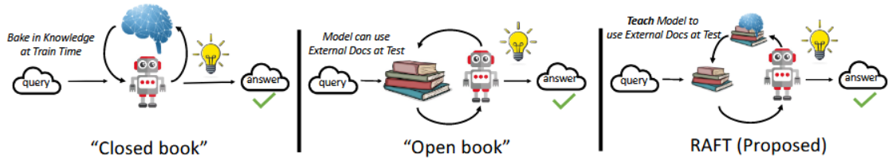
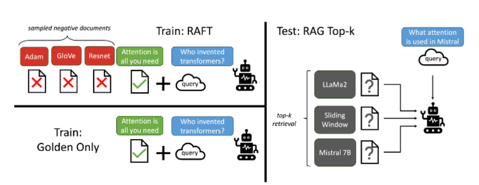
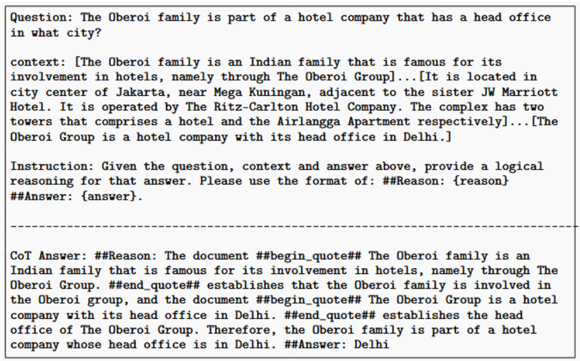
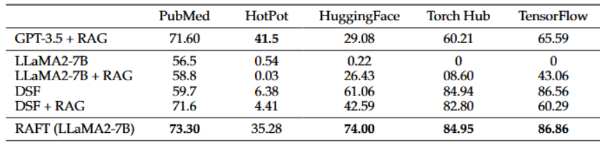
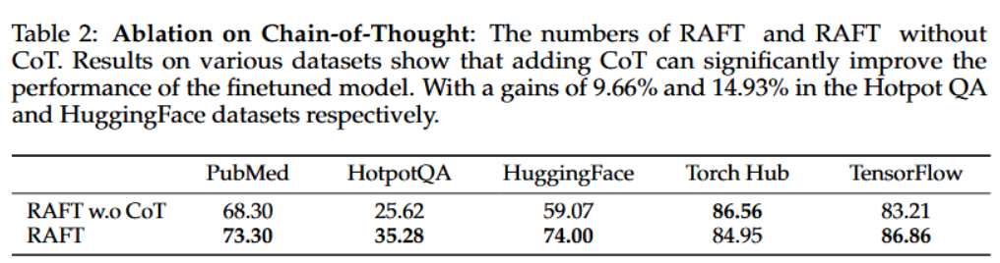
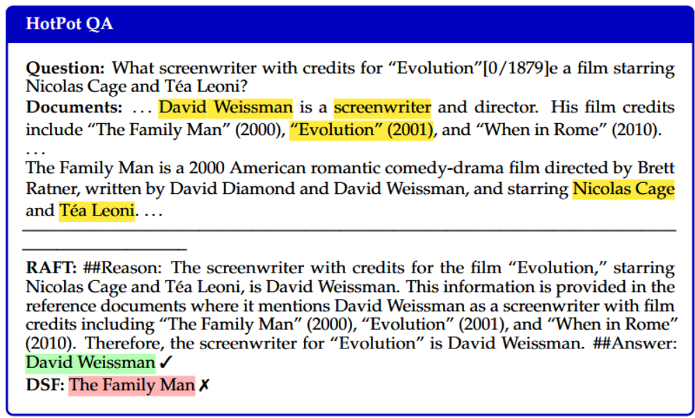
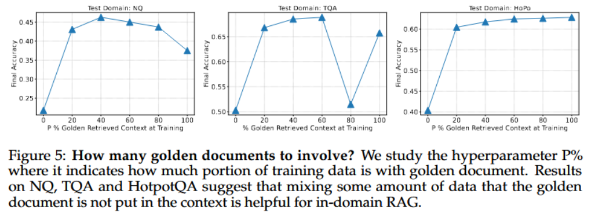
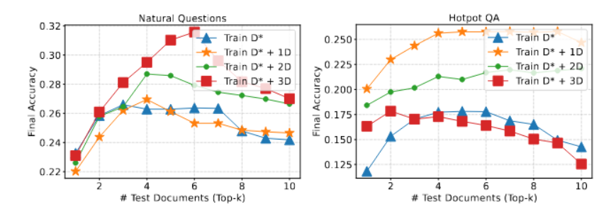

# RAFT-Adapting Language Model to Domain Specific RAG 리뷰

Adapting Language Model : 언어모델에 적용하는 것

Domain Specific RAG : 도메인에 특화된 RAG

**즉 Languamge Model을 Domain 특화된 RAG에 적용하는 것으로 이해함**

# Abstract

긴 말뭉치 텍스트 데이터에 대해 LLM을 사전학습 시키는 것은 이제 standard Paradigm이 되었다.

그래서 많은 Downstream Application 들은 LLM을 사용할 때, RAG-based prompting이나 fine-tuning으로 pre-trained 모델에 새로운 정보를 추가시키는 것이 일반적이다.

하지만 domain에 최적화시키는 방법으로는 RAG와 Fine-tuning이 아직 좋은 방법은 아니라고한다.

그래서 저자들은 Retrieval Augmented Fine Tuning (RAFT)라는 방법론을 제시하였다.

이 방법론은 Open-book에서 **Domain에 특화된 질의응답 모델의 능력을 향상시키기 위한 방법론**이다.

RAFT를 Training 하는 과정은 다음과 같다.

- 질문과 검색된 문서들을 주어주고 답에 도움이 되지 않는 문서(distractor documents)들을 무시한다.
- 정답에 도움을 주는 관련있는 문서에서 그대로 올바른 문장을 인용해서 사용한다.

그리고 CoT를 적용해서 모델의 추론하는 능력을 향상시켰음

이 RAFT는 PubMed, HotpotQA, Gorilla Dataset과 같은 Domain-Speicfic RAG에서 성능을 향상시켰다.

> **RAG + SFT = RAFT**

# Introduction

특정 domain에서 LLM을 사용하는 경우가 늘어나고 있다. (법률, 의학 등)

이 경우에는 모델 자체의 지식보다는 주어진 Domain의 문서 지식에 대해 추론하는 것이 더 정확도를 높인다.

이때, 저자들은 다음과 같은 질문을 던졌다.

> How do we adapt pre-trained LLMs for Retrieval Augmented Generation(RAG) in specialized domains?

- 특정 도메인에서 Pre-trained된 LLM을 RAG에 어떻게 적용할 수 있을까?

그래서 2가지의 방법을 고려했다고 한다.

1. RAG 기반 In-conext Learning
2. SFT (Supervised Fine-Tuning)

RAG기반의 방법은 질의응답을 할 때, 관련문서를 참조할 수 있다.

- 하지만, 해당 도메인을 제대로 설정하지 못하고, 제대로 학습되지 않는다.

SFT는 문서에서 일반적인 패턴을 더 잘 학습하고 원하는 task와 user preferences에 좀 더 잘 맞출 수 있게 제공한다.

- 하지만, 현재의 SFT 방법으로는 관련 문서 검색에 불완전성이 존재함

그래서 저자들은 이 두 방법을 섞은 **RAFT**라는 방법을 제안한다.

- Fine-tuning을 통해서 특정 도메인의 지식을 더 잘 학습하고, 잘못 검색된 정보에 대해서도 Robustness하게 답변할 수 있는 장점이 있다!

**관련성 있고 관련성 없는 검색된 문서들을 인식함**으로써 오픈북처럼 시험을 보는 것과 유사하다

# Methods

### Supervised Fine-Tuning (SFT)

기존의 SFT 방식은 pre-training이나 SFT training Phase에서 얻은 지식들을 기반으로 질문에 답하는 능력을 향상시키는 방향으로 학습하고서 RAG를 붙여서 추가 정보와 같이 Prompt에 넣어서 질문에 응답하는 형태로 되어있다.

${\text{Train}: \ \ Q → A}, \\{\text{0-shot Inference:} \ \ Q → A}, \\ {\text{RAG Inference:} \ \ Q + D → A}$

### RAFT

모델이 RAG된 결과를 잘 활용하도록 학습 데이터를 준비했다고 한다.

다음과 같이 trainset을 준비한다.

$Q$ : Question

$A^{*}$ : 문서 $D^{*}$ 에서 생성된 CoT 스타일의 답변

$D^{*}$ : 선택된 문서

$D*$ : Golden 문서 (무슨 문서야 저게, 핵심적인 문서라는거겠지?)

$D_{k}$ : 문서 sets

$D_i$ : 잘못된 문서 (distractor Documents)

여기서 Golden Document는 관련있는 문서를 뜻하고 꼭 한 개일 필요가 없다고 이야기한다.

$P$ 비율만큼의 question($q_i$)에 대해서, golden documents ($d_i^*$)와 Distractor Documents($d_{k-1}$)을 유지하고 $1-P$는 오로지 Distractor Documents만 포함하여 데이터셋을 구축

기존 SFT 방식처럼 fine-tune을 시켰고, 제공된 문서와 질문을 통해서 정답을 생성하도록 학습을 시켰다고 한다.

저자들은 본인들의 RAG 방식으로 domain에서 더 나은 RAG 성능을 보였다.

- Golden Document을 제거함으로써, 검색하는 것 대신에 정답을 기억하도록 하였다.

결과적으로 Test 시나리오에서, Q와 RAG 파이프라인으로부터 검색된 Top-k Documents를 모델에 제공된다.

Training Quality를 올리기위한 가장 중요한 요소로, CoT와 같은 방법을 사용하였다고 한다.

CoT 형식의 답변을 생성하고, 참조한 문서를 명백하게 표시함으로써, answering question에서 모델의 정확도를 높였다.

- The Document 하고 `##begin_quote##` ~ `##end_quote##` 이렇게 참조 문서를 명확하게 인용하는 방식으로 하였다.
- 이 프롬프트는 LLM이 자신의 생성된 추론과 답변을 평가 → 올바른 추론과 답변과 비교하도록 도움
  - 자신의 추론에서 오류를 식별 → 개선을 위한 핵심 통찰을 추출하도록 유도
  - `GenerateExplanation` ? 이건 뭐지

# Evaluation

General Domain Dataset (Wiki기반 ODQA dataset - Movie, Sports, etc..)

- Natural Questions (NQ), Trivia QA, HOtpotQA 데이터셋들

Specific Domain Dataset (from APIBench)

- (HuggingFace, TorchHub, TensorflowHub) = Gorilla Dataset, PubmedQA

위 데이터셋들을 사용해서 평가를 진행하였다

비교 모델은 다음과 같다.

- LLaMA2-7B (with 0-shot Prompting) - Not using RAG
- LLaMA2-7B (with RAG)
- Domain-Specific Finetuning with 0-shot Prrompting (DSF) - Basemodel은 LLaMA2-7B
- Domain-Specific Finetuning with RAG (DSF + RAG) - Basemodel은 LLaMA2-7B

# Results

HotPotQA에서 기존 LLaMA2-7B+RAG 보다 35.23% 로 상승되었다는 걸 볼 수 있고 대부분 LLaMA2-7B + RAG보다 48%, 76% 등 매우 높은 상승률을 보였다.

그외에도 다른 모델보다 더 뛰어난 성능을 보였는데, 도메인 특화에 있어서도 다른 모델보다 더 뛰어나다는것을 확인할 수 있다.

GPT3.5랑 비교해도 RAFT에서 유의미한 성능향상을 보였다.

다음은 CoT를 적용했을 때와 아니었을 때를 비교한다.

- CoT가 있을 때보다 다 더 높은 성능을 보였지만 TorchHub는 오히려 더 낮은 성능을 보였다.
- QA만 제공하는 것보단 reasoning chain을 함께 제공하는 것이 모델 성능 향상에 큰 도움이 됨
- 

아래는 RAFT, DSF가 추론하는 방법들의 예시

- QA Pair로만 학습하는 것보다 context를 함께 고려해서 학습하는 것이 중요함을 이야기한다.

- 이 그래프는 $P$에만 golden document를 포함시키고, $1-P$에는 포함시키지 않은 것이 성능 향상이 된다.
- golden document만 학습하는 것 보다 distractor document만으로도 학습하는 것이 RAG 성능을 높이는데 도움이 된다고 한다.

다음은 Top-k의 개수에 따라 얼마나 robustness한지 실험하는 그림이다.

- 위 실험과 비슷하게, Top-k를 가져오면서 그 중 일부 개수를 distractor document를 포함 시킨 실험이다.
- 전반적으로 Distractor를 포함한 경우가 더 성능이 높은 것을 볼 수 있다

# Conclusion

- RAFT는 특정 도메인 내 Open-book기반으로 질문에 답하는 모델의 성능을 향상시키기 위한 설계된 학습 전략
- distractor document와 학습시키고, 데이터셋 일부는 golden document가 없는 방식으로 학습했고, CoT 기반으로 answer를 생성하게 하는 방법들을 강조한다.
- 그리고 introduction에서 이야기했던 특정 도메인 내에서와 전반적인 도메인 둘다 실험을 진행해서 Robustness함을 보였음

개인적인 의견

- 뭔가 구체적인 학습 과정이 잘 안나와있음
  - RAG의 chunk 방법이라던지.. 명확하지 않음
  - RAG성능…에따라도 갈릴 것 같은데…
- PubMed QA만 테스트 해봤는데, 다른 특화된 도메인도 필요하지 않나 싶음

### Reference

https://dwin.tistory.com/162

https://ostin.tistory.com/486

https://happy-jihye.github.io/nlp/nlp-25/

https://aiforeveryone.tistory.com/45
